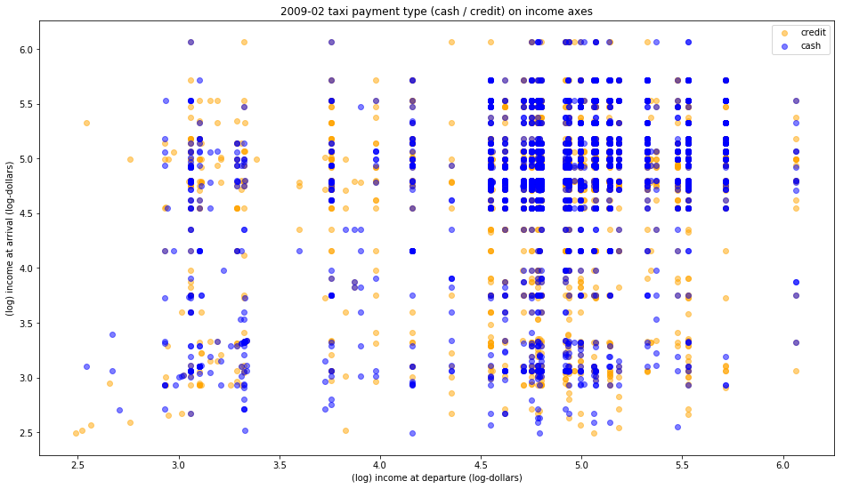

Analysis [here](taxi_cash_credit.ipynb).

This plot shows the arrival vs. departure income for 2009 NYC taxi trips, as from the midterm, with payment method as the coloring. For example, the top right quadrant contains trips from high-income neighborhoods to other high-income neighborhoods. 

We can see there is no linear pattern - a logistic regression model I ran verified this by coming back with an accuracy of 0. I also tried a multi-layer perceptron, just in case there was a simple nonlinear class boundary here (this visualization implies there's maybe some cluster of cash payments in the high income arrival / high income departure quadrant), but that failed as well - I think it's fairly safe to conclude that there is no information contained in the departure / arrival incomes about whether a rider paid cash or credit.

I wonder if this relationship would hold in later years, e.g. if credit has become more pervasive among affluent people.
